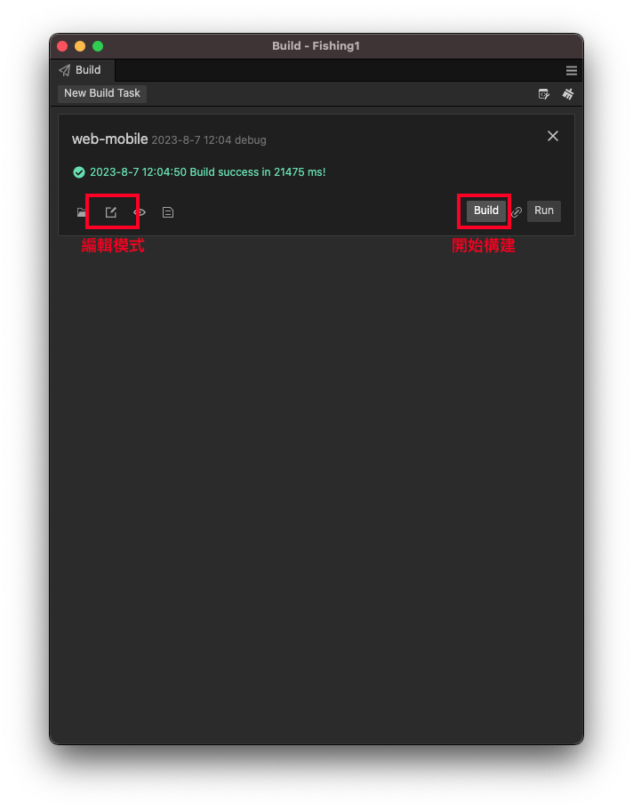

Empty
//-{[key:string]:AnimationAndEffect.AniEffectBase};
{"fs":[
    22855,15,33170,203004,true,10,
    22948,13,29163,211000,false,
    22980,4,26658,104003,true,
    22982,5,26658,113011,false,
    23005,7,26658,204002,false,
    23010,7,26658,202001,true,
    23016,10,26658,209002,false,
    23019,4,23653,105005,true,
    23029,2,23653,104010,true,
    23035,1,23653,104009,true,
    23068,7,21649,201002,true,
    23070,7,21649,211000,false,
    23078,1,20647,102003,false,
    23084,2,20647,105002,false,
    23109,15,19146,205003,true,
    23168,13,16142,213003,false,
    23189,1,14639,108011,false,
    23194,1,14639,108004,false,
    23206,6,14639,102006,true,
    23209,6,14639,109004,true,
    23219,11,14639,207002,true,
    23241,4,11633,103008,true,
    23251,7,11633,213000,true,
    23252,7,11633,213003,true,
    23264,5,10632,113006,false,
    23265,5,10632,113009,false,
    23274,6,10632,106003,true,
    23275,6,10632,106001,true,
    23278,6,10632,106000,true,
    23286,15,9631,206003,false,
    23288,3,8630,109000,false,
    23296,3,8630,109002,false,
    23320,5,6627,105000,true,
    23323,5,6627,105008,true,
    23324,5,6627,105011,true,
    23325,5,6627,103009,true,
    23331,5,6627,103003,true,
    23370,1,5623,107000,false,
    23380,2,2619,112002,true,
    23386,4,2619,110010,false,
    23388,4,2619,110000,false,
    23420,12,2619,210002,true,
    23440,13,1616,202000,true]}

[22855,19,33170,203004,true,10,22948,13,29163,211000,false,22980..]
103006
203004
106000

以下為單一筆資料的內容>>
22855,19,33170,203004,true,10
0->fishID 
1->fishType 
2->alreadyRunTime--->目前存活的時間 
3->pathId 
4->isRevese  
5->level-->成長魚種(會變大的)..沒有就不代入了

//--這邊都是groupPath
typeID:3, pathID: 1--103001
typeID:3, pathID: 2--103002
typeID:6, pathID: 10--107010

typeID:6, pathID: 11--107011

typeID:9 & 10 ＆ 11 都偏折90度??--110000


typeID: 12, pathID: 8--113008


addfish的時候會再紀錄一個時間=creatTime
在第一次init的時候要把creattime-alreadyRunTime(用來初始路徑在哪一點(配合server的時間))

會在拿到一個fishspeed的資料,是跟server的校正時間,
每次的updateTime需要在乘上speedtime.

路徑的最後一筆資料的時間要剃除(totaltime累加的時候不要累加到最後一筆資料)

每次 update送進來的是data.getTime的毫秒數近來


PS更新機制相關的文章
https://chenpipi.cn/post/cocos-creator-source-launch-and-main-loop/#mainLoop
        
https://www.gushiciku.cn/pl/pedk/zh-tw


### 打包與上版說明 2023/12/27 update

本地打包測試版(debug=true, sourcemap=true, md5Cache=false)
```
npm run build
```

本地打包正式版(debug=true, sourcemap=true, md5Cache=false)
```
npm run release
```

自動版本說明： package.json中的game_version為遊戲版本號，當執行npm run build時，會自動迭代第三碼。\n
執行npm run release則不會自動迭代，依賴RD自行更改第二碼。
npm run build 或 release 會判斷當前的作業系統執行不同的CLI。 CLI指令的路徑需要看user安裝creator的路徑在哪。

### 打包與上版說明

透過Cocos creator的打包面板進行打包，位置： Project(專案) -> Build（構建)\
打包完成後會在專案底下的build/ 產生 web-mobile\
將該資料夾複製並覆蓋到 deploy專案  https://gitlab.in-app.cc/frontend/fish/bb-fishing-master-series/fishhunter-deploy \
commit/push 到deploy專案前，記得commit message補上這次的git hash （透過source tree右鍵複製copy sha-1 hash） \
接著前往 deploy專案查看README.md 如何部署。\

